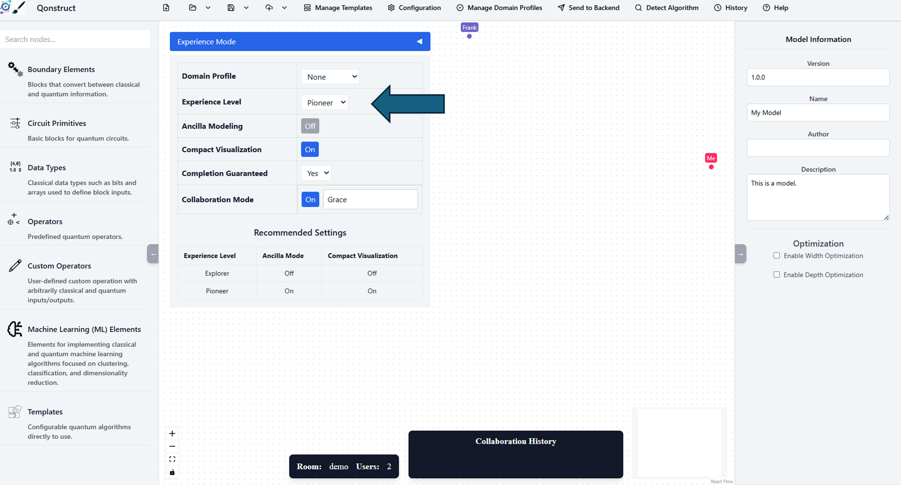
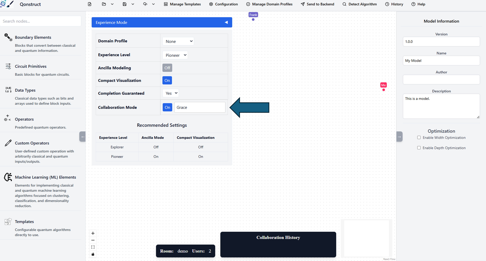
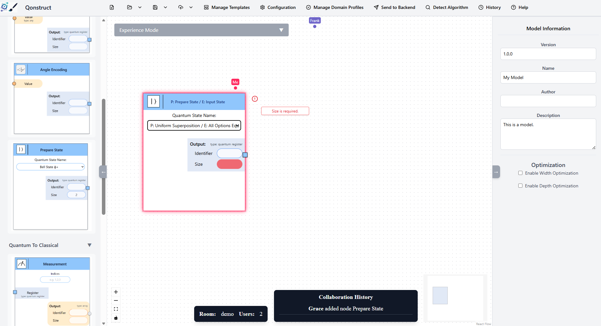
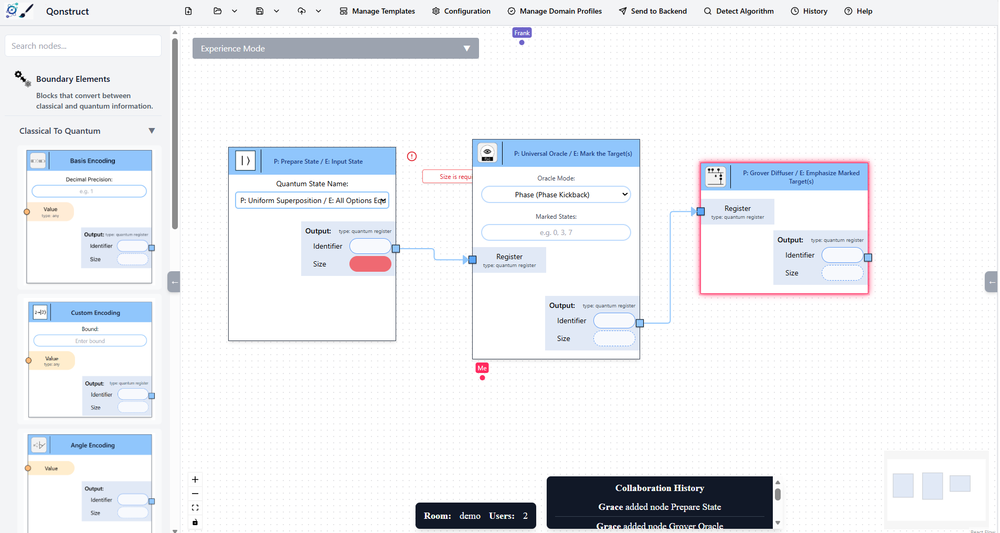
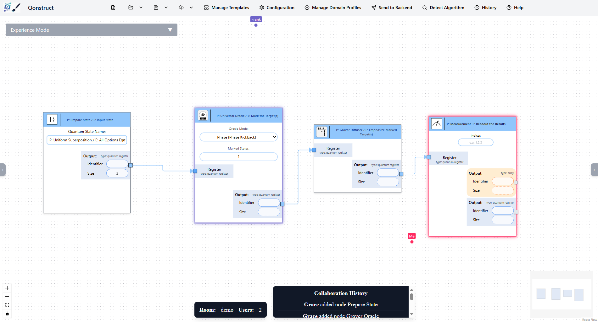
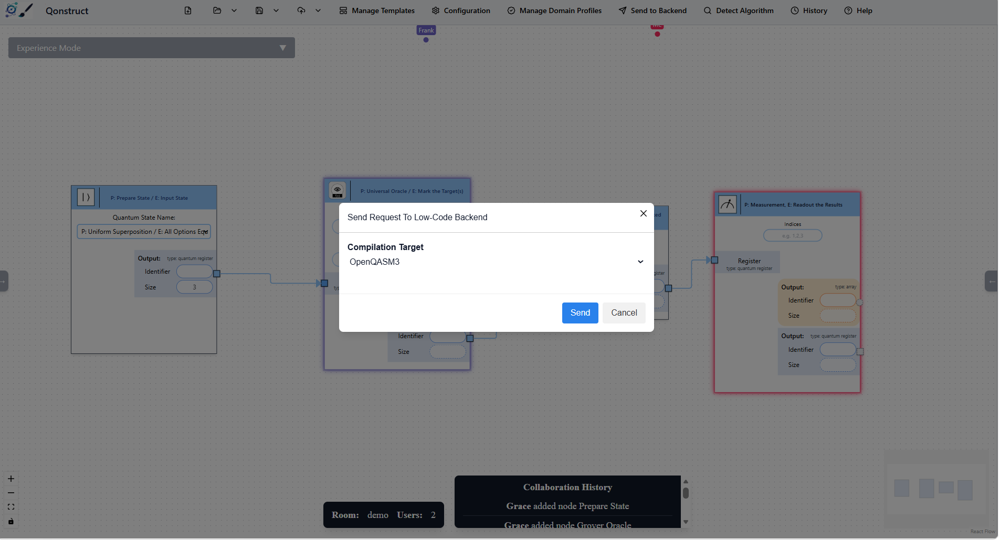
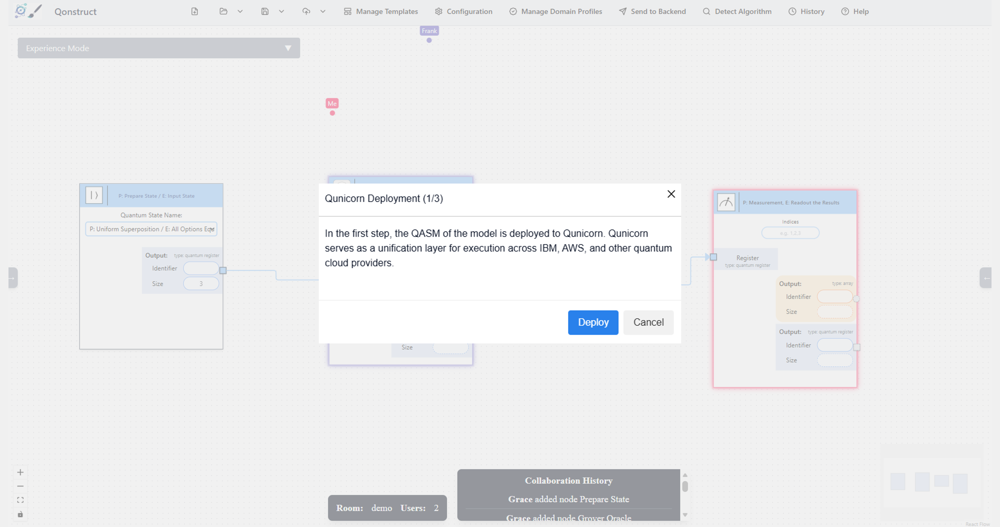
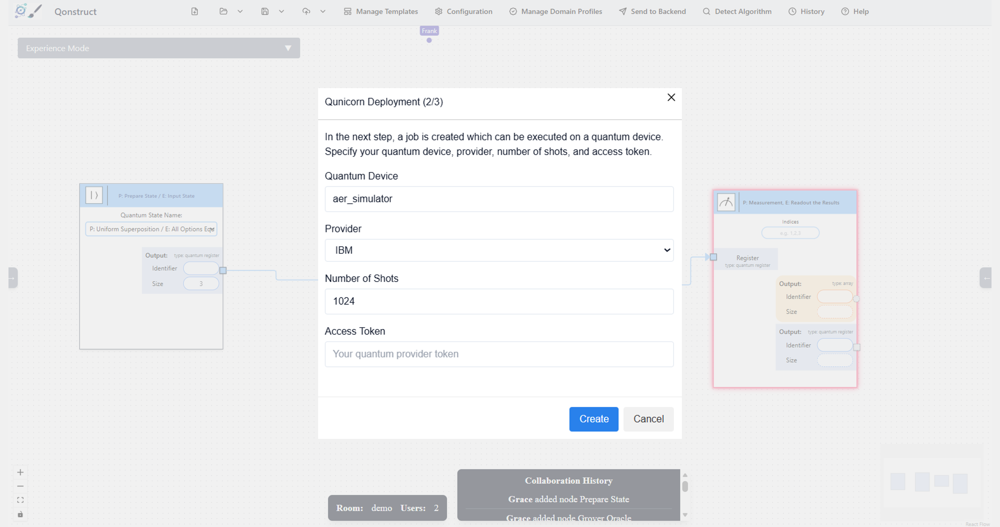
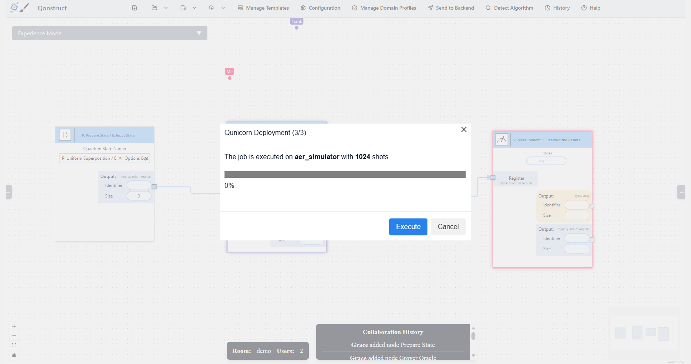
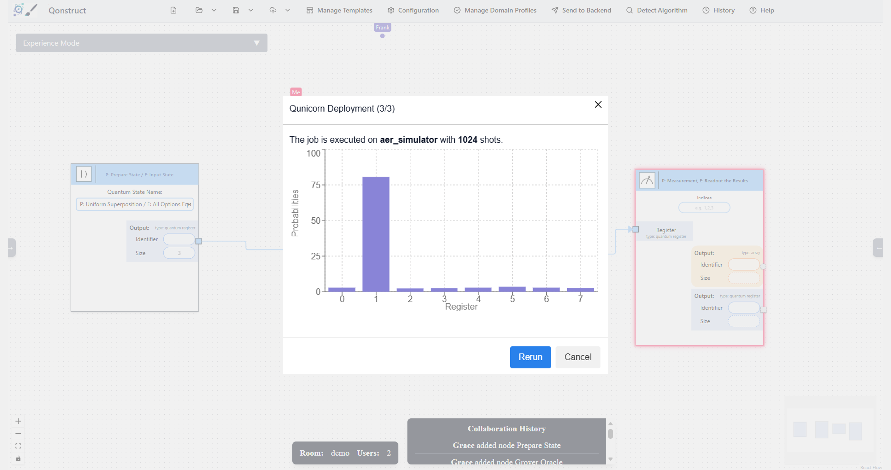

---

title: Hands-On Session 2
layout: default
navigation_weight: 4
---


# Hands-On Tutorial: Low-Code Quantum Application Development — From Visual Modeling to Execution Part 2

This practical session guides participants through the end-to-end lifecycle of a quantum application using the Qonstruct framework. The tutorial emphasizes a **visual, model-driven quantum model**, where participants design quantum algorithms using a low-code environment and execute them via automated compilation and quantum middleware.

Participants will explore how high-level quantum models are transformed into executable circuits and deployed on quantum backends without requiring direct circuit-level programming.

---

## Architectural Components

The underlying framework consists of three integrated core services:

* **Quantum Low-Code Modeler:** A web-based graphical workspace enabling collaborative visual modeling of quantum algorithms. It allows users to define quantum workflows at a high level of abstraction instead of manually specifying quantum circuits.
* **Backend Transformation Service:** A compiler engine that validates visual quantum models and automatically transforms them into executable quantum circuits (OpenQASM3) or workflows.
* **Qunicorn:** A middleware layer for orchestrating execution of quantum circuits across heterogeneous quantum cloud providers and simulators.

---

## Step 1: Initialize the Services

Execute the following commands in your terminal to launch the containerized infrastructure:

```bash
git clone https://github.com/LaviniaStiliadou/2026-quantics.git
cd docker
docker-compose up -d
```

---

## Step 2: Access the Workspace Layout

Open your primary web browser window and navigate to the application ecosystem endpoint:

**URL:** `http://localhost:4242`

The interface will initialize with the default visual modeling canvas.


---

## Step 3: Simulate Multi-Role Environments

To demonstrate collaborative software engineering across different domain roles (e.g., a business analyst and a hardware expert), open a second browser tab or an incognito window pointing to the same endpoint:

`http://localhost:4242`

Access the workspace configuration settings panel in this second tab and switch its active profile layout to **Expert Mode**. This unlocks advanced node properties and deeper register structures.


---

## Step 4: Initialize Real-Time Collaboration & Synchronization

On both active browser tabs, navigate to the **Experience Mode** menu and enable **Collaboration Mode**.

The underlying framework will instantly synchronize the shared state machine. You will observe concurrent workspace telemetry displaying multi-user sessions and real-time cursor tracking across both design interfaces.


---

## Step 5: Define State Domain Boundaries

In the first browser tab, open the **Boundary Elements** component drawer on the left structural palette.

Drag a **Prepare State** element block onto the central modeling grid space.

Observe how the block instantly appears in the second browser tab via real-time synchronization.


> 💡 **Note:** If you prefer to bypass manual component mapping at any point, you can directly upload the validated baseline file from the repository via `models/grover.json`.

---

## Step 6: Append Algorithmic Operators

Expand the **Operators** drawer hierarchy and locate the **Quantum Operators** sub-category layout.

Drag the **Oracle** and **Grover Diffuser** modules onto the canvas workspace.

Connect the structural output node from the **State Preparation** module into the input nodes of the subsequent quantum operators.



---

## Step 7: Concurrent Parameter Injection & Measurement

Return to the **Boundary Elements** menu and append a trailing **Measurement** block to the execution chain.

Wire the output of the **Diffuser** block to the input entry of the **Measurement** node.

To experience the collaborative synchronization, use your second browser tab (**Expert Mode**) to click on the components and specify the quantum register sizing and your designated oracle search parameters within the properties panel.

Watch your first browser tab automatically update to reflect these structural attribute adjustments.

---

## Step 8: Trigger the Model-to-Code Transformation

Select the **Send to Backend** execution action trigger located on the top application toolbar.

The transformation engine will validate the schema. Click **Continue** to progress past non-blocking verification or optimization notices.

Define **OpenQASM3** as your programmatic compilation target format.


---

## Step 9: Queue and Orchestrate Deployment

Navigate to the **History** workspace module to review generated build artifacts.

Locate your newly compiled OpenQASM3 sequence matrix and select **Execute Circuit**.

Advance through the structural blue prompt indicators to hand off the execution configuration safely to the Qunicorn service router.



---

## Step 10: Analyze Hardware Target Output

Once the runtime pipeline tasks finish processing inside the middleware execution queue, the interface displays the return registers.

The peak value amplification verifies successful tracking of the target data element ( |1\rangle ), completing the low-code example.


---

# Legal Notices

## Disclaimer of Warranty

Unless required by applicable law or agreed to in writing, Licensor provides the Work (and each Contributor provides its Contributions) on an "AS IS" BASIS, WITHOUT WARRANTIES OR CONDITIONS OF ANY KIND, either express or implied, including, without limitation, any warranties or conditions of TITLE, NON-INFRINGEMENT, MERCHANTABILITY, or FITNESS FOR A PARTICULAR PURPOSE.
You are solely responsible for determining the appropriateness of using or redistributing the Work and assume any risks associated with Your exercise of permissions under this License.

## Haftungsausschluss

Dies ist ein Forschungsprototyp.
Die Haftung für entgangenen Gewinn, Produktionsausfall, Betriebsunterbrechung, entgangene Nutzungen, Verlust von Daten und Informationen, Finanzierungsaufwendungen sowie sonstige Vermögens- und Folgeschäden ist, außer in Fällen von grober Fahrlässigkeit, Vorsatz und Personenschäden, ausgeschlossen.
